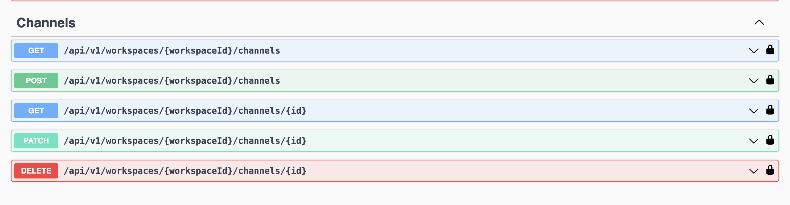

# 🚀 NestJS API!

### 🔍 Key features include:

- 🧩 **Modular Structure:** Organized into feature-based modules, promoting separation of concerns and reusability across different parts of the application.
- 🗄️ **Database Integration:** Seamless integration with MySQL, including pre-configured TypeORM support for efficient database interaction, along with migration management to handle schema changes.
- 🔐 **Authentication and Authorization:** Built-in JWT-based authentication module to handle user sessions securely, including registration, login, and user management APIs.
- 📄 **API Documentation:** Auto-generated API documentation using NestJS DTOs.
- 🛡️ **Validation and Error Handling:** Utilizes `class-validator` for easy validation through decorators, alongside custom exceptions with tailored messages and validation responses to ensure robust error handling.
- 🐳 **Docker Support:** Ready-to-use Docker and Docker Compose configurations for containerized deployment, ensuring consistency across different environments.

## 📝 Note on `NOTE`

Throughout the project, you will encounter `NOTE` comments that provide important context or instructions. These comments are intended to guide developers in understanding key parts of the code, configuration, and best practices.

## 💻 Prerequisites:

Ensure you have the following tools installed in your PC:

- NodeJS (along with npm)
- NestJS
- MySql

## 🚀 Run project:

1. Clone the repository:

```sh
git clone https://github.com/grishahovhanyan/nestjs-user-workspace.git
```

2. Navigate to the project directory:

```sh
cd nestjs-user-workspace
```

3. Run the following command to install all dependencies:

```sh
npm install
```

4. Create a .env file from the provided .env.example file.

```sh
cp .env.example .env
```

5. To run migrations, use the following command:

```sh
npm run migrations:run
```

6. To run the development environment, use the following command:

```sh
npm run start:dev
```

After starting the server, you can access the application at: http://localhost:PORT_FROM_ENV/swagger-ui/

## 🐳 Run project with docker compose:

1. After clone go to the project directory and create a .env file from the provided .env.example file.

```sh
cp .env.example .env
```

2. Build Docker images for a multi-container application defined in a Docker Compose file.

```sh
docker compose up --build
```

3. Run Docker containers based on the images created in the previous step.

```sh
docker compose up
```

## 🐳 Run project with docker:

1. After clone go to the project directory and create a .env file from the provided .env.example file.

```sh
cp .env.example .env
```

2. Build a Docker image for project using the Dockerfile located in the "docker" directory.

```sh
docker build . -f docker/Dockerfile
```

3. Run a Docker container using the image created in the previous step.

```sh
docker run --entrypoint /usr/src/app/docker/entrypoint.sh -it IMAGE_ID_FROM_PREVIOUS_STEP /usr/src/app/docker/start_node.sh
```

## ✏️ API V1 Endpoints

- **Healthcheck:** `GET /healthcheck/`

- **Register:** `GET /auth/register/`
- **Login:** `GET /auth/login/`

- **Get current user:** `GET /users/me/`
- **Update current user:** `PATCH /users/me/` (+image)
- **Get users:** `GET /users/` (+filtration, +search)
- **Get user by Id:** `GET /users/:id/`


- **Get workspaces:** `GET /workspaces/`
- **Create workspace:** `POST /workspaces/`
- **Update workspace by Id:** `PATCH /workspaces/:id/`
- **Get workspace by Id:** `GET /workspaces/:id/`
- **Delete workspace by Id:** `DELETE /workspaces/:id/`
- **Get invitations:** `GET /workspaces/invitations/`
- **Create invitation:** `POST /workspaces/:id/invitations/`
- **Update invitation by Id:** `PATCH /workspaces/invitations/:id/`


- **Get channels:** `GET /workspaces/:workspaceId/channels/`
- **Create channel:** `POST /workspaces/:workspaceId/channels/`
- **Update channel by Id:** `PATCH /workspaces/:workspaceId/channels/:id/`
- **Get channel by Id:** `GET /workspaces/:workspaceId/channels/:id/`
- **Delete channel by Id:** `DELETE /workspaces/:workspaceId/channels/:id/`



## 🗂️ NPM Commands

- **`npm run format`**: Formats TypeScript files in the `src`, `test`, and `libs` directories according to the rules defined in the `.prettierrc.js` configuration file.

- **`npm run lint`**: Executes ESLint to check for code quality issues and ensure that the code adheres to the defined coding standards.

- **`npm run build`**: Compiles TypeScript files into JavaScript and outputs the results into the `dist` folder, preparing the application for deployment.

- **`npm run start`**: Starts the NestJS application in production mode using the compiled files from the `dist` folder.

- **`npm run start:dev`**: Launches the application in development mode with live reloading enabled, automatically restarting the server when changes are detected.

- **`npm run start:debug`**: Runs the application in debug mode with live reloading, allowing for debugging and step-by-step code execution.

- **`npm run start:prod`**: Starts the compiled production-ready application using Node.js, running the code from the `dist/main` file.

- **`npm run typeorm`**: Runs TypeORM CLI commands using `ts-node` to handle database-related tasks, such as running migrations, without needing to compile TypeScript code first.

- **`npm run migrations:create`**: Creates a new migration file in the specified `migrations` directory, which can be used to define database schema changes.

- **`npm run migrations:generate`**: Automatically generates a migration file based on the current state of the entities, capturing any schema changes that need to be applied to the database.

- **`npm run migrations:run`**: Applies all pending migrations to the database, updating the schema according to the latest migration files.

- **`npm run migrations:rollback`**: Reverts the last migration that was applied, rolling back the database schema to the previous state.

## 🗂️ NestJS CLI Commands

- **`nest g module MODULE_NAME`**: Generates a new module in the application, creating a directory and file structure for the module.

- **`nest g service SERVICE_NAME`**: Generates a new service in the specified module, providing a class with dependency injection.

- **`nest g controller CONTROLLER_NAME`**: Generates a new controller in the specified module, enabling the creation of routes and request handlers.

- **`nest g class CLASS_NAME`**: Generates a new class in the specified directory, which can be used for utility functions, constants, or other shared logic.

- **`nest g library LIB_NAME`**: Generates a new library in the `libs/` folder, creating a reusable set of functionalities that can be shared across the application.

## 📝 Author

- **Grisha Hovhanyan** - [github:grishahovhanyan](https://github.com/grishahovhanyan)
